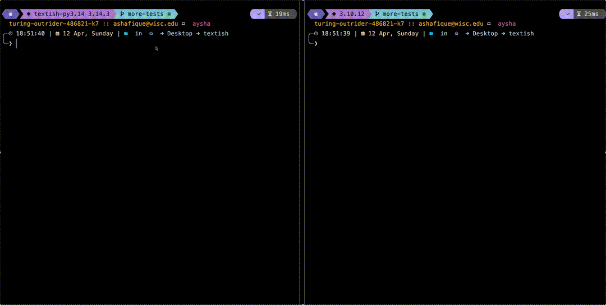

# textish

[](https://www.python.org/)
[](LICENSE)
[](https://asyncssh.readthedocs.io/)
[](https://github.com/Textualize/textual)



Serve [Textual](https://github.com/Textualize/textual) TUI apps over SSH. Point it at any command that runs a Textual app, give it a port, and anyone with an SSH client can connect and use the app in their terminal — no installation required on their end.

```python
import asyncio
from textish import AppConfig, serve

asyncio.run(serve(AppConfig(app_command="python my_app.py", port=2222)))
```

```
ssh localhost -p 2222
```

---

## How it works

Each SSH connection spawns the Textual app as a fresh subprocess attached to a server-side pseudo-terminal (PTY). textish bridges raw terminal bytes between the SSH channel and the PTY master file descriptor, so the app sees a normal terminal and can use Textual's standard terminal driver. Terminal resize events from the SSH client are applied to the PTY, causing the app to reflow just as it would in a regular shell.

This is the same basic idea as [wish](https://github.com/charmbracelet/wish) (Charmbracelet's SSH app framework for Go) and [inkish](https://github.com/Textualize/inkish), adapted for Python, asyncssh, and Textual apps.

For a deeper dive into the component design and data flow, see [ARCHITECTURE.md](ARCHITECTURE.md).

---

## Installation

Requires Python 3.12 or later.

```
pip install textish
```

---

## Usage

### Command line

```
textish "python my_app.py"
textish "python my_app.py" --port 3000
textish "python my_app.py" --host 127.0.0.1 --port 3000 --max-connections 10
textish "python my_app.py" --env APP_MODE=prod
```

```
$ textish --help
usage: textish [-h] [--host HOST] [--port PORT] [--host-key PATH]
               [--max-connections N] [--env KEY=VALUE]
               app_command

Serve a Textual app over SSH.

positional arguments:
  app_command           Shell command that launches your Textual app,
                        e.g. "python my_app.py".

options:
  --host HOST           Address to listen on. (default: 0.0.0.0)
  --port PORT           TCP port to listen on. (default: 2222)
  --host-key PATH       Path to the SSH host key file.
                        Defaults to ~/.ssh/ssh_host_key.
  --max-connections N   Maximum simultaneous SSH sessions.
                        0 means unlimited. (default: 0)
  --env KEY=VALUE       Environment variable to pass to the app.
                        Can be repeated. (default: [])
```

### Python API

```python
import asyncio
from textish import AppConfig, serve

# Note: requires a host key at ~/.ssh/ssh_host_key by default
asyncio.run(serve(AppConfig(app_command="python my_app.py", port=2222)))
```

#### Existing Event Loop

If you are already inside a running event loop (for example, embedding textish inside a larger async application):

```python
from textish import AppConfig, serve

await serve(AppConfig(app_command="python my_app.py", port=2222))
```

#### Configuration object

```python
from textish import AppConfig, serve

config = AppConfig(
    app_command="python my_app.py",
    port=2222,
    max_connections=10,
    env={"APP_MODE": "prod"},
)
await serve(config)
```

App subprocesses receive only the variables in `env` plus terminal variables
managed by textish: `TERM`, `COLUMNS`, and `ROWS`.

### Host keys

By default, textish looks for a host key at `~/.ssh/ssh_host_key`. You can generate one with:

```
ssh-keygen -t ed25519 -f ssh_host_key -N ""
```

Or pass an explicit path:

```python
await serve(AppConfig(
    app_command="python my_app.py",
    port=2222,
    host_key_path="./ssh_host_key",
))
```

### Public-key authentication

By default, textish allows all connections without authentication — suitable for private networks. To restrict access, pass an auth callback:

```python
ALLOWED_KEYS = {
    "ssh-ed25519 AAAAC3Nza..."}

def auth(username: str, public_key: str) -> bool:
    return public_key in ALLOWED_KEYS

await serve(AppConfig(
    app_command="python my_app.py",
    port=2222,
    auth=auth,
))
```

The function receives the username and the client's public key in OpenSSH format. It may also be `async`.

---

## Limitations

A few things worth knowing before you deploy this anywhere serious.

**One process per connection.** Every SSH connection spawns a completely independent subprocess running your app. There is no shared state between clients, and no concept of a persistent session. If a client disconnects and reconnects, they get a brand new app instance from scratch.

**No reconnection support.** Related to the above — if a client's connection drops mid-session, there is nothing to reconnect to. The subprocess is terminated and any in-progress state is gone.

**PTY required.** textish only supports interactive shell sessions with a pseudo-terminal. Clients that connect without a PTY (for example, `ssh host -p 2222 some-command`) will be rejected with an error message. This is a deliberate constraint, not something that is straightforward to lift.

**Unix-style PTYs required.** The server-side app process is attached to a pseudo-terminal using the operating system PTY APIs. This is a natural fit on macOS and Linux; native Windows support would need a ConPTY-specific implementation.

---

## Development

Install with dev dependencies:

```
poetry install --with dev
```

Run the tests:

```
poetry run pytest
```

Lint:

```
poetry run ruff check .
```

Type check:

```
poetry run mypy
```
