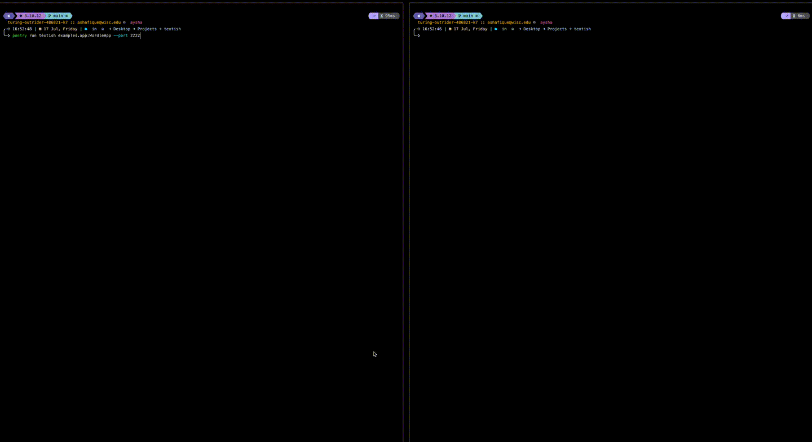

# textish

[](https://www.python.org/)
[](LICENSE)
[](https://asyncssh.readthedocs.io/)
[](https://github.com/Textualize/textual)



Serve [Textual](https://github.com/Textualize/textual) TUI apps over SSH. Import your Textual app, hand it to `serve`, and anyone with an SSH client can connect and use the app in their terminal — no installation required on their end.

Each connection runs the app in its own **subinterpreter**: separate module state and, on Python 3.14+, its own GIL, so many sessions run concurrently in a single process with real multi-core parallelism.

```python
# run.py
from textish import serve
from myapp import MyApp   # your Textual App, in an importable module

serve(MyApp, port=2222)
```

```
python run.py
# then, from another terminal:
ssh localhost -p 2222
```

---

## How it works

Textual talks to the outside world through a `Driver`. The stock drivers assume a real terminal: they read `sys.stdin` on a thread, write `sys.stdout`, set `termios`, and install `SIGWINCH` handlers. textish replaces that with a driver whose "terminal" is an SSH channel, and runs each app in its own subinterpreter so one server process can host many apps at once.

For each connection:

- The main interpreter owns asyncssh (and its C dependencies such as cryptography).
- A fresh subinterpreter is created, running only the pure-Python Textual app plus a `QueueDriver`.
- Because a subinterpreter cannot reference the SSH channel object, bytes cross between the two over cross-interpreter queues (`concurrent.interpreters.create_queue`): app output is put on an outbound queue that a main-interpreter pump forwards to the channel; keystrokes and resizes flow back on an inbound queue.
- Each subinterpreter runs on its own OS thread (via `Interpreter.call_in_thread`), which is what gives real parallelism.

This is the same idea as [wish](https://github.com/charmbracelet/wish) (Charmbracelet's SSH app framework for Go): the app is imported and run in-process rather than launched as a subprocess.

For the component design and data flow, see [ARCHITECTURE.md](ARCHITECTURE.md).

---

## Installation

Requires Python 3.14 or later (the subinterpreter backend uses `concurrent.interpreters`, added in 3.14).

```
pip install textish
```

---

## Usage

Pass `serve` your `App` subclass (or a zero-argument factory, or a `"module:attr"` string). It must live in an importable module — not inside the script you run directly — because each connection re-imports it in its own subinterpreter. `serve` blocks until interrupted and generates a host key on first run.

### Command line

```
textish my_package.my_module:MyApp
textish my_package.my_module:MyApp --port 3000
textish my_package.my_module:MyApp --host 127.0.0.1 --port 3000 --max-connections 10
```

```
$ textish --help
usage: textish [-h] [--host HOST] [--port PORT] [--host-key PATH]
               [--max-connections N] [--authorized-keys PATH] [-v]
               app_ref

Serve a Textual app over SSH (one subinterpreter per client).

positional arguments:
  app_ref               Import path of your Textual app, e.g.
                        "my_package.my_module:MyApp".

options:
  --host HOST           Address to listen on. (default: 0.0.0.0)
  --port PORT           TCP port to listen on. (default: 2222)
  --host-key PATH       Path to the SSH host key file.
                        Defaults to ~/.ssh/ssh_host_key.
  --max-connections N   Maximum simultaneous SSH sessions.
                        0 means unlimited. (default: 0)
  --authorized-keys PATH
                        Path to an OpenSSH authorized_keys file.
  -v, --verbose         Enable debug logging.
```

### Python API

```python
from textish import serve
from myapp import MyApp

serve(MyApp, port=2222, max_connections=10)
```

`serve` blocks and runs its own event loop. If you are embedding textish in a program that already has a running loop, build an `AppConfig` and use the async entry point instead:

```python
from textish import AppConfig, serve_async

await serve_async(AppConfig(app_ref="myapp:MyApp", port=2222))
```

### Host keys

`serve` generates a host key at `./ssh_host_key` on first run. To use a specific key, pass a path (it is generated there if missing):

```python
serve(MyApp, port=2222, host_key_path="~/.ssh/ssh_host_key")
```

Or generate one yourself:

```
ssh-keygen -t ed25519 -f ssh_host_key -N ""
```

### Public-key authentication

By default, textish allows all connections without authentication — suitable for private networks. To restrict access, pass an auth callback:

```python
ALLOWED_KEYS = {"ssh-ed25519 AAAAC3Nza..."}

def auth(username: str, public_key: str) -> bool:
    return public_key in ALLOWED_KEYS

serve(MyApp, port=2222, auth=auth)
```

The function receives the username and the client's public key in OpenSSH format. It may also be `async`. See also `authorized_keys()` for reading an OpenSSH `authorized_keys` file.

---

## Performance

Because each session is a subinterpreter plus an OS thread rather than a whole subprocess, memory per session is a few MB instead of the tens of MB a fresh Python interpreter costs, and busy sessions render in parallel across cores (each subinterpreter has its own GIL on 3.14+). A reproducible benchmark is in [`benchmarks/bench_subinterp.py`](benchmarks/bench_subinterp.py):

```
python benchmarks/bench_subinterp.py --sessions 100
python benchmarks/bench_subinterp.py --sessions 100 --work 200000   # add CPU load
```

`--work` makes each app burn CPU on mount, which is what surfaces the multi-core parallelism.

---

## Security

Subinterpreters are an isolation and parallelism feature, **not** a security sandbox. Per the CPython documentation, they must not be relied on in security-sensitive situations: a malicious C extension can cross the boundary, and a hard crash still takes the whole process down. Run only apps you trust. For untrusted code, isolate it at the OS level instead (a separate low-privilege user, cgroup limits, and a seccomp or landlock sandbox).

---

## Limitations

**PTY required.** textish only supports interactive shell sessions with a pseudo-terminal. Clients that connect without a PTY (for example, `ssh host -p 2222 some-command`) are rejected with an error message.

**App must be importable.** The app is loaded by import path inside a subinterpreter, so it must be on the server's import path. A shell command is not accepted.

**Shared process.** All sessions share one OS process. A whole-process fault (a C-extension crash, out-of-memory) affects every session, unlike a one-process-per-connection design.

**Python 3.14+ and pure-Python apps.** The backend requires `concurrent.interpreters` (3.14+), and the served app and its dependencies must be subinterpreter-safe (Textual and its tree are pure Python; some third-party C extensions are not yet).

---

## Development

Install with dev dependencies:

```
poetry install --with dev
```

Run the tests (the end-to-end tests require Python 3.14):

```
poetry run pytest
```

Lint and type-check:

```
poetry run ruff check .
poetry run mypy
```
